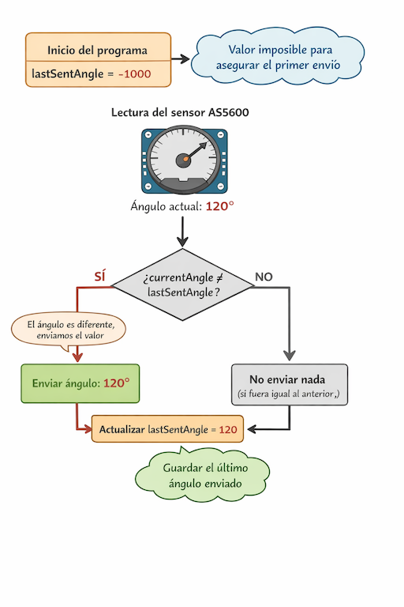

###### ♟️ ChessBot---Zero
---

## 📘 Manual de sensors.cpp

---

### ➡️ Envío de ángulo con lastSentAngle

Este diagrama explica cómo se decide enviar un ángulo del sensor AS5600 solo cuando cambia:
<p align="center">
  
</p>


### *** 🔀 Dos buses I2C diferentes ***

✏️ Descripción:
Direccion común pero perifericos I2C distintos
Porque aunque ambos sensores tengan dirección 0x36, están en buses físicos diferentes. Es como tener dos calles distintas con la misma numeración

🧩 Implementación:
Sensor 1 → pines 4 y 5
Sensor 2 → pines 26 y 27
En el RP2040 eso significa que se están usando dos controladores I2C distintos:
Wire (I2C0)
Wire1 (I2C1)

La direccion es la misma para ambos sensores:
```c
#define AS5600_ADDR 0x36

Wire.setSDA(4);
Wire.setSDA(5);
Wire1.setSDA(26);
Wire1.setSDA(27);
```
Para leer:
```c
Wire.beginTransmission(AS5600_ADDR);
Wire1.beginTransmission(AS5600_ADDR);
```

### *** ⏳ Filtros para disminuir latencia por UART *** 

✏️ Descripción:
Para evitar saturar el Puerto UART al enviar el angulo se envian datos solo si el angulo cambia un valor minimo indicado


🧩 Implementación:

```c
#define DELTA_DEG 0.5` // Solo enviar si el ángulo cambió al menos 0.5°
```
```c
#define SEND_INTERVAL 33  // ms -> ~30Hz 
// Limita la frequencia máxima de envio
// Aunque el ángulo cambie mucho, nunca se enviará más rápido que eso.
// Es como decir:
// Máximo 30 actualizaciones por segundo.
// Eso hace que el OLED pueda seguir el ritmo sin saturarse.
```
```c
>`unsigned long lastSendTime = 0;
// Guarda el momento en milisegundos del último envío.
// Se compara con millis() para saber cuánto tiempo pasó.

// Ejemplo:
if (millis() - lastSendTime >= SEND_INTERVAL) // Eso verifica que hayan pasado al menos 33 ms.
```
```c
float lastSentAngle = -1000;
// Guarda el último ángulo que se envió.
// ¿Por qué -1000?
// Porque es un valor imposible (el AS5600 solo va de 0 a 360).
// Entonces el primer envío siempre ocurre.

// Ejemplo:
if (abs(degrees - lastSentAngle) >= DELTA_DEG) // Si la diferencia es mayor a 0.5°, se envía.
```

🧠 Resumen conceptual
Estas 4 líneas hacen un filtro doble:

1️⃣ Filtro por cambio mínimo → evita microvariaciones
2️⃣ Filtro por tiempo → evita saturar el bus
- Sin esto pasaba:
AS5600 → 1000 lecturas por segundo
UART → se llena
Pico → recibe mezclado
OLED → parpadea y números raros
- Con esto pasa:
AS5600 → 1000 lecturas
Zero → filtra
UART → 30 limpias por segundo
Pico → feliz
OLED → fluido


